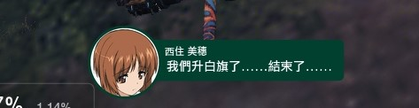
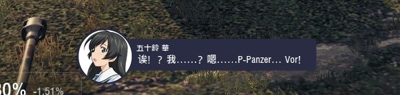

這是將戰車世界官方所提供的少女戰車字幕模組內部的文本進行了繁體中文化 

具體使用方法如下
必須先安裝原本官方的字幕檔模組 [https://wgmods.net/1138/](https://wgmods.net/6725/)

安裝完畢之後再將整個repo下載下來丟到res_mods/遊戲版號/mods/gup.subtitles

這個模組觸發的條件為需要套用官方的少女戰車語音才會呈現出字幕樣式
可以在res_mod/gui/soundModes/main_sound_modes.xml 這個檔案內自行加入代碼
要加入的代碼可以在 Assets/how to add.txt 裡面找到

如果沒有main_sound_modes.xml可以在Assets裡面找到
main_sound_modes-original.xml-為原始遊戲版本
main_sound_modes.xml-加入代碼的版本(可能會與其他少女戰車語音模組衝突)

上面動作完成後在遊戲中語音設定選單中選擇對應的語音

進入遊戲就可以看見效果了

  
  

此翻譯品質有使用Grok AI進行校驗，如果有哪邊覺得翻譯怪怪的可以留言

This project provides a Traditional Chinese (繁體中文) localization of the in-mod text used by the official “Girls und Panzer” subtitles mod for World of Tanks.

How to use

First install the original official subtitles mod: [https://wgmods.net/1138/](https://wgmods.net/6725/)

After installation, download this repository and copy the entire folder to:
res_mods/<game_version>/mods/gup.subtitles
(replace <game_version> with your current World of Tanks version)

After installation, download this repository and copy the entire folder to:
res_mods/<game_version>/mods/gup.subtitles

This mod is activated only when the crew voice pack is set to the official collaboration Girls und Panzer voice; only then will the subtitle style appear.

You can manually add the required code in res_mods/gui/soundModes/main_sound_modes.xml.
The snippet to add can be found in Assets/how to add.txt.
If main_sound_modes.xml does not exist, you can also find these files in Assets:

main_sound_modes-original.xml — the original game file

main_sound_modes.xml — the version with the code added (may conflict with other Girls und Panzer voice mods)

After completing the steps above, select the corresponding voice in the in-game audio settings menu:

Enter the game and you should see the effect:

The translation quality has been verified using Grok AI. If you find any translation errors, please leave a message.
