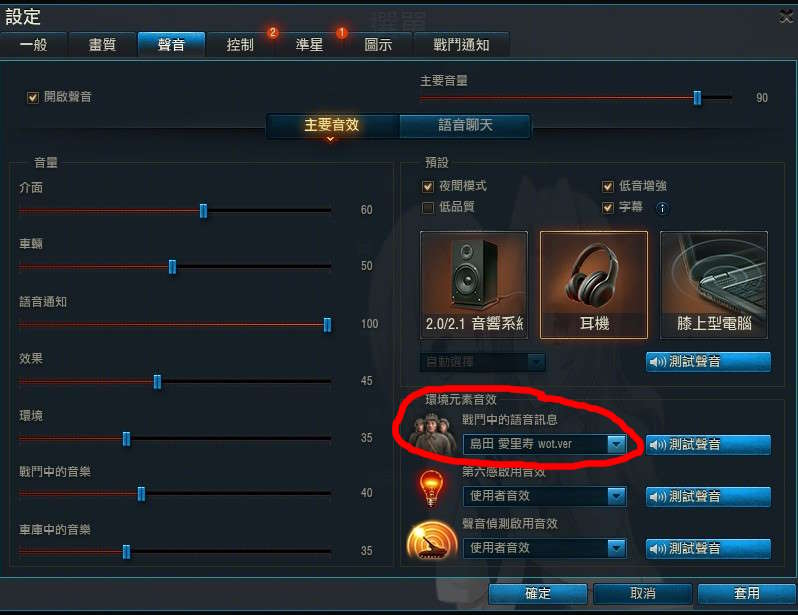
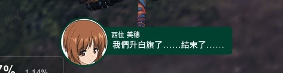
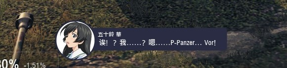

# 少女與戰車 字幕模組中文化 (World of Tanks: Girls und Panzer Subtitles Traditional Chinese)

本專案將《戰車世界》官方提供的「少女與戰車字幕模組」文本進行**繁體中文化**。  
翻譯名詞對齊台灣代理版本，並參考 Grok AI 進行校驗。

> [!NOTE]
> 原官方字幕模組來源：[WGMods.net (6725)](https://wgmods.net/6725/)

---

## 🛠 安裝教學 (Installation)

根據您的需求，請選擇以下其中一種安裝方式：

### 方案 A：快速安裝 (無其他語音模組)
如果您**沒有**安裝其他語音模組，想直接一勞永逸：
1. 前往 [Releases](https://github.com/YourUsername/YourRepo/releases) 下載檔名含 `xml` 的檔案：`gup.subtitles.tw_版號.xml.wotmod`。
2. 將檔案放入：`遊戲目錄/mods/[當前遊戲版本號]/` 即可。

### 方案 B：手動整合 (已有其他語音模組)
如果您已有安裝其他模組（如 `GuP_VoiceSelector` 或 `Aslain`），請採此方式：
1. 下載 `gup.subtitles.tw_版號.wotmod` 並放入 `遊戲目錄/mods/[當前遊戲版本號]/`。
2. 編輯（或建立） `res_mods/gui/soundModes/main_sound_modes.xml`。
3. 將 `Assets/how to add.txt` 內的代碼複製並貼入該 XML 檔案中。
   * *註：若無此 XML 檔案，可直接使用 `Assets` 資料夾內提供的範本。*

> [!CAUTION]
> **相容性提醒：**
> - 字幕觸發前提：需套用官方少女與戰車語音才會呈現字幕樣式。
> - 第六感語音可能會與其他模組產生衝突。
> - 乘員語音優先權：若乘員為「鮟鱇隊」但選單選「繼續高中」，會以「鮟鱇隊」語音優先。

---

## 📸 遊戲截圖 (Screenshots)

### 設定方式 (Settings)

### 遊戲效果 (In-game Preview)

  
  

---

## 🌍 English Description

### Overview
This project provides **Traditional Chinese localization** for the official "Girls und Panzer" subtitle mod in World of Tanks. The translation adheres to the official Taiwanese localized terminology and has been verified with Grok AI for accuracy.

### Installation Guide

#### Method 1: Standalone Installation (No other voice mods)
1. Download the version containing `xml` in the filename (e.g., `gup.subtitles.tw_[version].xml.wotmod`) from [Releases].
2. Move the file to: `[WoT_Directory]/mods/[Current_Game_Version]/`.

#### Method 2: Manual Integration (Compatible with other voice mods)
Use this method if you already use mods like `GuP_VoiceSelector` or `Aslain's Modpack`.
1. Download the standard `.wotmod` file (without `xml` in name) to your `mods` folder.
2. Open (or create) `res_mods/gui/soundModes/main_sound_modes.xml`.
3. Copy the code snippet from `Assets/how to add.txt` and paste it into the XML file.
   * *Note: Template files are available in the `Assets` folder if needed.*

### Important Notes
* **Prerequisite:** Subtitles will only appear when an official GuP voice pack is selected in the audio settings.
* **Compatibility:** Six-sense (Sixth Sense) audio might conflict with other custom voice mods.
* **Priority:** Crew-specific voices take precedence. For example, if your crew belongs to the "Ankou Team," their voices will trigger regardless of your menu selection.
* **Translation:** Since the source text is in English, minor nuances may differ from the original Japanese voice lines.

---

## 💬 意見回饋 (Feedback)
如果您發現任何翻譯錯誤或改進建議，歡迎提交 **Issue** 或留言告知！  
If you encounter any translation errors or have suggestions, feel free to open an **Issue** or leave a comment!